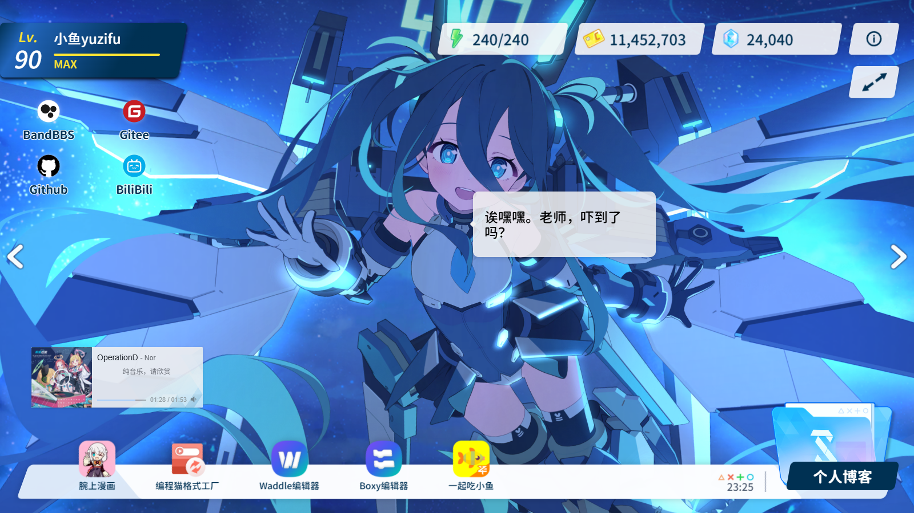

<p align="center">
  <a href="./README.md">简体中文</a> | <a href="./README_EN.md">English</a>
</p>

<h1 align="center">小鱼档案</h1>

<p align="center">
  <a href='https://gitee.com/sf-yuzifu/homepage/stargazers'></a>
  <a href='https://gitee.com/sf-yuzifu/homepage/members'></a>
  <a href='https://github.com/sf-yuzifu/homepage/stargazers'></a>
  <a href='https://github.com/sf-yuzifu/homepage/forks'></a>
  <a href="./LICENSE"></a>
</p>

<div align="center">有关小鱼的《蔚蓝档案》风格的个人主页</div>




## 📖 项目简介

**小鱼档案（Fish Archive）** 是一个高度还原《蔚蓝档案》游戏风格的个人主页。项目基于 **Vue 3 + Vite** 构建，通过 **PIXI.js + Spine** 渲染游戏回忆大厅的骨骼动画（Live2D），并实现了摸头、视线跟随、捏脸、语音对话等一系列互动效果，力求在浏览器中还原游戏内「与学生相处」的沉浸感。

全站内容（站点信息、联系方式、项目展示、音乐列表、Live2D 角色等）均可通过根目录的 `_config.yaml` 完成定制，个人简介正文写在 `bio/{语言}.md`，无需改源码即可部署属于你自己的主页。

## ✨ 功能特点

### 🎮 游戏 UI 高度还原

- 加载界面（进度条 + 随机看板头像）
- 主界面复刻（等级 / AP / 信用点 / 青辉石等游戏元素）
- 弹窗复刻与「什亭之箱」幕布转场动画
- 个人简介等二级界面

### 🎭 回忆大厅 Live2D 互动（Spine 渲染）

- 多个学生回忆大厅切换（上一页 / 下一页）
- 全局观赏模式（隐藏 UI，纯享回忆大厅）
- 摸头互动：长按头部区域，学生头部跟随手指
- 点击对话：触发角色台词与语音
- 视线跟随：按住拖动时学生看向触点（参数取自官方资源解包）
- 捏脸 / 特殊骨骼拖拽互动
- 随机眨眼与待机小动作

### 🎵 氛围体验

- Banner 音乐播放器（网易云音乐随机播放）
- 《蔚蓝档案》风格点击特效
- 自定义游戏风格虚拟光标
- 体力 / 信用点 / 青辉石数值系统：体力同步设备电量（不支持时按 6 分钟/点恢复），信用点随停留时长累计，青辉石每日签到领取（本地 localStorage 持久化，悬停可查看说明）

### 🌍 国际化与 PWA

- 内置 简体中文 / 繁體中文 / English / 日本語 四种语言
- 自动检测浏览器语言，语言包按需动态加载
- PWA 离线缓存与站点更新提示

### ⚡ 性能优化

- 中文字体构建时子集化（cn-font-split），按 unicode-range 分片按需加载
- Arco Design 按需引入、路由懒加载、第三方依赖分组分包
- 图片自动优化与 gzip 压缩

## 🔗 在线预览

- [小鱼档案](https://yzf.moe)
- [小鱼档案 - 备用](https://yuzifu.top/)

## 🛠️ 技术栈

| 技术 | 用途 |
| --- | --- |
| [Vue 3](https://cn.vuejs.org/) + [Vue Router](https://router.vuejs.org/zh/) | 前端框架与路由 |
| [Vite](https://vitejs.cn/) | 构建工具 |
| [PIXI.js](https://github.com/pixijs/pixijs) + [spine-pixi-v7](https://www.npmjs.com/package/@esotericsoftware/spine-pixi-v7) | 回忆大厅 Spine 骨骼动画渲染 |
| [Arco Design](https://arco.design/) | UI 组件库（按需引入） |
| [APlayer](https://aplayer.js.org/#/) + [howler.js](https://github.com/goldfire/howler.js) | 音乐播放 / 角色语音播放 |
| [js-yaml](https://github.com/nodeca/js-yaml) | YAML 配置解析 |
| [vite-plugin-pwa](https://github.com/vite-pwa/vite-plugin-pwa) + Workbox | PWA 离线缓存 |
| [cn-font-split](https://github.com/KonghaYao/cn-font-split)（经 vite-plugin-font） | 中文字体子集化 |
| [ba-click-fx](https://github.com/CialloKing/ba-click-fx) | 点击特效 |
| [BlueArchive-Cursors](https://github.com/makipom/BlueArchive-Cursors) | 游戏风格光标 |
| [Resource Han Rounded CN](https://github.com/CyanoHao/Resource-Han-Rounded) | 站点字体 |
| [Iconfont](https://www.iconfont.cn/) | 图标字体库 |

## 🚀 部署方式

### 使用第三方部署平台

#### 1. Vercel

[](https://vercel.com/import/project?template=https://github.com/sf-yuzifu/homepage)

#### 2. Netlify

1. `Fork` [本项目](https://github.com/sf-yuzifu/homepage)
2. [登录 Netlify 控制台](https://app.netlify.com)，选择 `Add new site` - `Import an exist project` 添加网站
3. 接着选择 GitHub 认证来读取我们的 GitHub 项目列表。在列表中搜索我们刚才 `Fork` 生成的仓库名，点击该项目开始基于该仓库创建我们的 Netlify 网站

### 本地构建网页文件

> **推荐环境：**
>
> - node > 18.0.0
> - npm > 8.15.0

1. 安装 yarn

```bash
# 安装 yarn
npm install -g yarn
```

2. 克隆此项目到本地
3. 在项目根目录下运行

```bash
# 安装依赖
yarn install

# 预览（开发环境）
yarn dev

# 构建
yarn build

# 预览（生产环境预览）
yarn preview
```

> 构建完成后，静态资源会在 **`dist` 目录** 中生成，你可以将 **`dist` 目录中的文件** 上传至服务器。
>
> 其中关于宝塔如何部署的（[https://cloud.tencent.com/developer/article/1977167](https://cloud.tencent.com/developer/article/1977167)）

## ⚙️ 个性化

本项目个性化主要通过根目录的 **`_config.yaml`**（站点配置）与 **`bio/`**（个人简介正文）完成（YAML / Markdown，方便阅读；如需从旧版 JSON 迁移配置，可通过 [此网站](https://www.json.cn/json2yaml/) 快速转换）。

修改配置后重新构建部署即可生效。

个人简介页右侧正文来自 **`bio/{语言}.md`**（如 `bio/zh-CN.md`），支持 GitHub 风格 Markdown 与内嵌 HTML（例如 GitHub Stats 图片），并随浏览器语言切换。缺某个语言时回退到 `bio/en-US.md`，再缺则用目录里的任意一份；fork 后按需只写自己要用的语言即可。

社交分享卡片由构建时用 sharp 将 **`shots/zh/pic1.png`**（首页）与 **`pic2.png`**（简介页）等比裁切为 1200×630 生成；`/bio` 有独立 `og` 标签（部署时需让该路径落到 `bio/index.html`）。

<details>
<summary><b>点击展开 _config.yaml 配置说明</b></summary>

```yaml
# 网站基本配置
title: Fish Archive # 网站标题 - 浏览器标签页显示的标题
description: A personal homepage in Blue Archive style. # 网站描述 - 用于搜索引擎优化和社交媒体分享
favicon: /favicon144.png # 网站图标路径 - 浏览器标签页显示的小图标
author: Yuzifu # 网站作者姓名
keywords: 'Blue Archive, 小鱼yuzifu, Personal Homepage' # 网站关键词 - 用于搜索引擎优化，逗号分隔

# 站点规范地址 - 用于拼接 og:image/og:url/canonical 的绝对 URL（社交分享卡片要求绝对地址），
# 留空则 og:url/canonical 不输出、og:image 退回相对路径
url: 'https://yzf.moe'

# ICP备案号 - 中国大陆备案信息，留空表示未备案
ICP: ''
# 公安备案号 - 中国大陆网站备案信息，留空表示未备案
gongan: ''

# PWA配置 - 渐进式Web应用配置
manifest:
  name: Fish Archive # PWA应用完整名称
  short_name: Fish Archive # PWA应用简短名称 - 用于桌面显示
  description: A personal homepage in Blue Archive style. # PWA应用描述
  theme_color: '#128AFA' # PWA主题颜色 - 影响浏览器UI颜色
  start_url: / # PWA启动URL - 应用启动时打开的页面
  id: Homepage # PWA应用唯一标识符
  # PWA图标配置
  icons:
    # 大尺寸图标 - 用于桌面安装
    - src: /favicon512.png
      sizes: 512x512
      purpose: any maskable
    # 小尺寸图标 - 用于移动设备
    - src: /favicon144.png
      sizes: 144x144

# 个人游戏等级信息
level: 90 # 当前等级
exp: 8382 # 当前经验值
nextExp: 8381 # 升级所需经验值
gold: 11451419 # 信用点初始值（首次访问后由本地「陪伴时长」累计接管）
pyroxene: 24000 # 青辉石初始值（首次访问后由本地「每日签到」累计接管）

# Iconfont字体库地址 - 阿里云图标字体库
iconfont: 'https://at.alicdn.com/t/c/font_4336463_umq8x001wf9.js'

# 底部项目展示区域 - 显示相关项目链接（推荐5个）
dock:
  # 项目1
  - name: Fish Archive Project
    href: 'https://gitee.com/sf-yuzifu/eat-fish-together'
    imgSrc: /img/fish.png

# 左侧联系方式区域（推荐4个）
contact:
  # 联系方式1
  - name: Github Profile
    href: 'https://github.com/sf-yuzifu'
    iconfont: icon-github

# 任务按钮配置 - 页面左下角的任务按钮
task:
  # 任务按钮显示文本
  name: Blog Link
  # 任务按钮链接地址
  href: 'https://blog.yzf.moe/'

# Banner音乐播放器配置
banner:
  # 网易云音乐歌曲ID列表 - 用于随机播放
  musicID:
    - 2059151619

# Live2D角色配置
#
# 每个角色可选配 interactions 段定制交互动效（全部缺省时按骨名自动探测，一般无需配置；
# 默认数值取自官方资源包解包的 SpineDragIK 参数，bone 缺省自动探测 Touch_Eye/Touch_Point 等）：
#   interactions:
#     # 视线跟随：按住拖动时角色看向触点；false 可禁用
#     gaze: { bone: Touch_Eye, smoothTime: 0.15, minX: -48.1, maxX: 79.0, minY: -57.2, maxY: 98.3 }
#     # 摸头：长按头部区域触发，头部跟随手指；false 可禁用
#     pat: { bone: Touch_Point, smoothTime: 0.1, minX: -9.6, maxX: 13.5, minY: -33.9, maxY: 32.6 }
#     # 捏脸/特殊骨骼拖拽；false 禁用，数组则覆盖自动探测结果（默认自动探测 Face_IK/Neck_IK/breast_* 等）
#     dragBones:
#       - { bone: breast_01L, radius: 120, range: 30, smoothTime: 0.08 }
#
# bone 为骨骼名；minX/maxX/minY/maxY 为拖拽钳制范围（骨架单位，相对基准位置的偏移，可用 range 做对称简写）；
# radius 为按下命中半径；smoothTime 为平滑时间（秒，越小越跟手）
memorialLobbies:
  # 角色1 - Aris
  - name: Aris
    # Live2D模型文件路径
    path: '/l2d/aris/'
    # 骨骼动画文件
    skel: 'Aris_home.skel'
    # 纹理图集文件
    atlas: 'Aris_home.atlas'
    # 角色在屏幕中的水平位置偏移（0-1之间）
    offset: 0.45
    # 对话框显示位置配置
    dialogueDisplay:
      # X坐标位置（可以是分数）
      x: -1/4 - 1/16
      # Y坐标位置（可以是分数）
      y: -1/16
      # 对话框位置（left/right）
      position: right

# 个人简介页配置
bio:
  student:
    - name: CH0334_spr
      # Live2D模型文件路径
      path: '/l2d/CH0334_spr/'
      # 骨骼动画文件
      skel: 'CH0334_spr.skel'
      # 纹理图集文件
      atlas: 'CH0334_spr.atlas'
  bth:
    - name: 蔚蓝档案
      path: /img/card/ba.png
    - name: 明日方舟
      path: /img/card/arknight.png
```

</details>

## 🌐 有关 i18n

本项目支持多语言国际化。配置采用「**基础配置 + 语言包覆盖**」，个人简介正文按语言分文件：

- **`_config.yaml`**：基础配置，存放与语言无关的内容（资源路径、链接、图标等）
- **`bio/{语言}.md`**：个人简介正文（Markdown），随界面语言切换
- **`src/locales/*.yaml`**：各语言翻译文件，按语言深度合并覆盖基础配置中的文本内容

站点会自动检测访客浏览器语言并加载对应语言包，未匹配时回退至英语；语言包为独立 chunk 按需加载，不会拖累首屏速度。

### 翻译文件目录结构

```
src/locales/
├── zh-CN.yaml  # 简体中文翻译文件
├── zh-TW.yaml  # 繁体中文翻译文件
├── en-US.yaml  # 英文翻译文件
└── ja-JP.yaml  # 日文翻译文件

bio/
├── zh-CN.md    # 简体中文简介正文
├── zh-TW.md    # 繁体中文简介正文
├── en-US.md    # 英文简介正文
└── ja-JP.md    # 日文简介正文
```

### 翻译文件配置项

以 `src/locales/zh-CN.yaml` 为例，翻译文件包含以下配置项：

```yaml
# 网站标题、描述和关键词
title: 网站标题
description: 网站描述
keywords: 关键词列表

# PWA配置
manifest:
  name: PWA应用名称
  short_name: PWA应用短名
  description: PWA应用描述

# 作者名称
author: 作者名称

# 底部项目展示区域（按索引与 _config.yaml 中的 dock 一一对应）
dock:
  - name: 项目名称

# 左侧联系方式区域
contact:
  - name: 联系方式名称

# 任务按钮配置
task:
  name: 任务按钮显示文本

# 纪念大厅角色显示名称
memorialLobbies:
  - name: 角色名称

# 角色语音对话翻译（按角色索引配置）
memorialLobbies[0]:
  voice:
    对话键: 对话内容

# 通用界面翻译字符串
translate:
  about: 关于
  projectWebsite: 项目地址：
  info: 通知
  ifSkip: 是否跳过？
  update: 站点更新提示
  ok: 确认
  cancel: 取消
  bio: 个人简介
  bioTitle: 自我介绍
  prevPage: 上一页
  nextPage: 下一页

bio:
  bth:
    - name: 蔚蓝档案
    - name: 明日方舟
```

## 🎁 有关学生回忆大厅 L2D 文件获取

1. 自己去游戏解包中获取
2. 去 [基沃托斯古书馆](https://kivo.fun/) 中的 `角色图鉴` — `切换到鉴赏模式` — `回忆大厅` 当中自行抓包获取

## 💖 基于本项目的最佳实践

> 感谢使用此项目的大佬们能够进一步完善这个项目 😭😭😭
>
> 欢迎其他大佬通过 Issue 来向我投稿最佳实践 ❤❤❤

1. [Home - 杏仁レモンティー](https://apricotlemontea.com/)
2. [ElectroHeavenVN's Homepage](https://electroheavenvn.github.io/homepage/)

## 📄 开源协议

本项目基于 [MIT License](./LICENSE) 开源。
