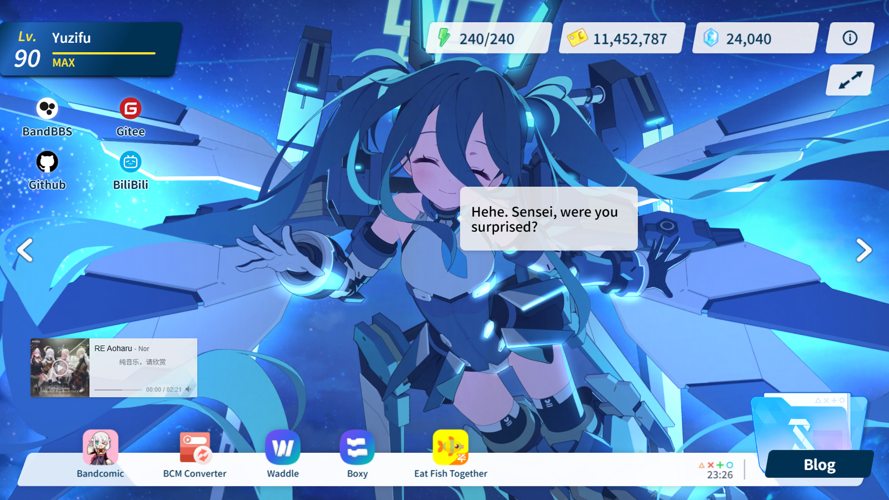

<p align="center">
  <a href="./README.md">简体中文</a> | <a href="./README_EN.md">English</a>
</p>

<h1 align="center">Fish Archive</h1>

<p align="center">
  <a href='https://gitee.com/sf-yuzifu/homepage/stargazers'></a>
  <a href='https://gitee.com/sf-yuzifu/homepage/members'></a>
  <a href='https://github.com/sf-yuzifu/homepage/stargazers'></a>
  <a href='https://github.com/sf-yuzifu/homepage/forks'></a>
  <a href="./LICENSE"></a>
</p>

<div align="center">A Blue Archive-style personal homepage for me.</div>




## 📖 Introduction

**Fish Archive** is a personal homepage that faithfully recreates the style of the game *Blue Archive*. Built with **Vue 3 + Vite**, it renders memorial lobby skeletal animations (Live2D) from the game via **PIXI.js + Spine**, and implements a series of interactive effects such as head-patting, gaze following, cheek dragging, and voice dialogue — striving to reproduce the immersive feeling of "spending time with students" right in your browser.

All site content (site info, contacts, project showcase, music list, Live2D characters, etc.) can be customized through `_config.yaml` in the root directory. The bio page body lives in `bio/{locale}.md` — deploy your own homepage without touching the source code.

## ✨ Features

### 🎮 Faithful Game UI Recreation

- Loading screen (progress bar + random avatar)
- Main interface recreation (Level / AP / Gold / Pyroxene and other game elements)
- Popup recreation and the "Shittim Chest" curtain transition animation
- Personal bio and other secondary pages

### 🎭 Memorial Lobby Live2D Interactions (Spine Rendering)

- Switch between multiple student memorial lobbies (previous / next page)
- Global viewing mode (hide UI and enjoy the memorial lobby)
- Head-patting: long-press the head area and the student's head follows your finger
- Tap to talk: trigger character lines and voice
- Gaze following: the student looks at your pointer while dragging (parameters extracted from official game resources)
- Cheek dragging / special bone dragging interactions
- Random blinking and idle motions

### 🎵 Atmosphere

- Banner music player (random playback from NetEase Cloud Music)
- Blue Archive-style click effects
- Custom game-style virtual cursor
- Wallet system: AP syncs with your device battery (falls back to recovering 1 AP per 6 minutes), credits accumulate with time spent on site, and pyroxene comes from daily sign-in rewards (persisted in localStorage, hover for details)

### 🌍 i18n & PWA

- Built-in support for 简体中文 / 繁體中文 / English / 日本語
- Automatic browser language detection, with language packs loaded on demand
- PWA offline caching and site update prompts

### ⚡ Performance Optimization

- CJK fonts are subsetted at build time (cn-font-split) and loaded on demand via unicode-range
- Arco Design imported on demand, route-level lazy loading, grouped vendor chunking
- Automatic image optimization and gzip compression

## 🔗 Preview

- [Fish Archive](https://yzf.moe)
- [Fish Archive - Backup](https://yuzifu.top/)

## 🛠️ Tech Stack

| Technology | Purpose |
| --- | --- |
| [Vue 3](https://vuejs.org/) + [Vue Router](https://router.vuejs.org/) | Frontend framework and routing |
| [Vite](https://vitejs.dev/) | Build tool |
| [PIXI.js](https://github.com/pixijs/pixijs) + [spine-pixi-v7](https://www.npmjs.com/package/@esotericsoftware/spine-pixi-v7) | Memorial lobby Spine skeletal animation rendering |
| [Arco Design](https://arco.design/) | UI component library (imported on demand) |
| [APlayer](https://aplayer.js.org/#/) + [howler.js](https://github.com/goldfire/howler.js) | Music playback / character voice playback |
| [js-yaml](https://github.com/nodeca/js-yaml) | YAML configuration parsing |
| [vite-plugin-pwa](https://github.com/vite-pwa/vite-plugin-pwa) + Workbox | PWA offline caching |
| [cn-font-split](https://github.com/KonghaYao/cn-font-split) (via vite-plugin-font) | CJK font subsetting |
| [ba-click-fx](https://github.com/CialloKing/ba-click-fx) | Click effects |
| [BlueArchive-Cursors](https://github.com/makipom/BlueArchive-Cursors) | Game-style cursors |
| [Resource Han Rounded CN](https://github.com/CyanoHao/Resource-Han-Rounded) | Site font |
| [Iconfont](https://www.iconfont.cn/) | Icon font library |

## 🚀 Deployment

### Using Third-Party Deployment Platforms

#### 1. Vercel

[](https://vercel.com/import/project?template=https://github.com/sf-yuzifu/homepage)

#### 2. Netlify

1. `Fork` [this project](https://github.com/sf-yuzifu/homepage)
2. [Log in to Netlify Console](https://app.netlify.com), select `Add new site` - `Import an exist project` to add a website
3. Then select GitHub authentication to read our GitHub project list. Search for the repository name we just `Fork`ed in the list, click on the project to start creating our Netlify website based on that repository

### History routes (refresh `/bio` without 404)

The app uses Vue Router `createWebHistory`. The build writes **`dist/bio/index.html`** (its own OG tags), so hosts that serve directory indexes (GitHub Pages, etc.) already work on refresh.

Hosts that only know about the root `index.html` will 404 on `/bio`. This repo ships SPA fallbacks (real files still win, so `bio/index.html` and assets are not overwritten):

| Platform | File |
| --- | --- |
| Vercel | `vercel.json` at the repo root (the Vite preset usually covers git imports; this file matters when you upload `dist` as static files) |
| Netlify / Cloudflare Pages | `public/_redirects` (copied into `dist`) |
| Apache | `public/.htaccess` (copied into `dist`) |

Nginx / BtPanel — point the site root at `dist` and add:

```nginx
location / {
  try_files $uri $uri/ /index.html;
}
```

Subpath deploys (e.g. `https://user.github.io/homepage/`) also need Vite `base` set to that prefix. This repo assumes the site lives at `/`.

### Local Build

> **Recommended Environment:**
>
> - node > 18.0.0
> - npm > 8.15.0

1. Install yarn

```bash
# Install yarn
npm install -g yarn
```

2. Clone this project to your local machine
3. Run the following commands in the project root directory

```bash
# Install dependencies
yarn install

# Preview (development environment)
yarn dev

# Build
yarn build

# Preview (production environment preview)
yarn preview
```

> After the build is complete, static resources will be generated in the **`dist` directory**. You can upload the **files in the `dist` directory** to your server.
>
> For how to deploy on BtPanel, see ([https://cloud.tencent.com/developer/article/1977167](https://cloud.tencent.com/developer/article/1977167))

## ⚙️ Customization

Customization is done through **`_config.yaml`** (site config) and **`bio/`** (bio page body) in the root directory (YAML / Markdown for easy reading; to migrate config from the legacy JSON format, you can use [this website](https://www.json.cn/json2yaml/) to quickly convert JSON to YAML).

After modifying the configuration, rebuild and redeploy for changes to take effect.

The right-hand bio text comes from **`bio/{locale}.md`** (e.g. `bio/en-US.md`). It supports GitHub-flavored Markdown and inline HTML (e.g. GitHub Stats images), and follows the visitor's language. Missing locales fall back to `bio/en-US.md`, then to any file in the folder — forks only need to add the languages they use.

Share cards are 1200×630 JPEGs cover-cropped at build time with sharp from **`shots/zh/pic1.png`** (home) and **`pic2.png`** (bio). `/bio` has its own Open Graph tags (`dist/bio/index.html`). See **History routes** above for refresh/404 hosting.

<details>
<summary><b>Click to expand the _config.yaml configuration guide</b></summary>

```yaml
# Website Basic Configuration
title: Fish Archive # Website title - displayed in browser tab
description: A personal homepage in Blue Archive style. # Website description - used for SEO and social media sharing
favicon: /favicon144.png # Website icon path - small icon displayed in browser tab
author: Yuzifu # Website author name
keywords: 'Blue Archive, Xiaoyu yuzifu, Personal Homepage' # Website keywords - used for SEO, comma-separated

# Canonical site URL - used to build absolute URLs for og:image/og:url/canonical
# (social share cards require absolute URLs). Leave empty to skip og:url/canonical
# and fall back to a relative og:image path
url: 'https://yzf.moe'

# ICP number - China registration number, empty if not registered or you're not in China
ICP: ''
# Public Security Registration Number - China registration number, empty if not registered or you're not in China
gongan: ''

# PWA Configuration - Progressive Web App configuration
manifest:
  name: Fish Archive # PWA app full name
  short_name: Fish Archive # PWA app short name - used for desktop display
  description: A personal homepage in Blue Archive style. # PWA app description
  theme_color: '#128AFA' # PWA theme color - affects browser UI color
  start_url: / # PWA start URL - page opened when app launches
  id: Homepage # PWA app unique identifier
  # PWA icon configuration
  icons:
    # Large icon - used for desktop installation
    - src: /favicon512.png
      sizes: 512x512
      purpose: any maskable
    # Small icon - used for mobile devices
    - src: /favicon144.png
      sizes: 144x144

# Personal game level information
level: 90 # Current level
exp: 8382 # Current experience points
nextExp: 8381 # Experience points needed to level up
gold: 11451419 # Initial credits (taken over by the local "time spent together" accumulation after the first visit)
pyroxene: 24000 # Initial pyroxene (taken over by the local "daily sign-in" accumulation after the first visit)

# Iconfont font library address - Alibaba Cloud icon font library
iconfont: 'https://at.alicdn.com/t/c/font_4336463_umq8x001wf9.js'

# Bottom project showcase area - display related project links (recommended 5)
dock:
  # Project 1
  - name: Fish Archive Project
    href: 'https://gitee.com/sf-yuzifu/eat-fish-together'
    imgSrc: /img/fish.png

# Left contact information area (recommended 4)
contact:
  # Contact 1
  - name: Github Profile
    href: 'https://github.com/sf-yuzifu'
    iconfont: icon-github

# Task button configuration - task button at the bottom left of the page
task:
  # Task button display text
  name: Blog Link
  # Task button link address
  href: 'https://blog.yzf.moe/'

# Banner music player configuration
banner:
  # NetEase Cloud Music song ID list - used for random playback
  musicID:
    - 2059151619

# Live2D Character Configuration
#
# Each character supports an optional `interactions` section to customize interaction effects
# (when omitted, bones are auto-detected by name, so no configuration is usually needed;
# default values come from the SpineDragIK parameters in the official resource packages,
# and `bone` auto-detects Touch_Eye/Touch_Point, etc.):
#   interactions:
#     # Gaze following: character looks at the touch point while dragging; false to disable
#     gaze: { bone: Touch_Eye, smoothTime: 0.15, minX: -48.1, maxX: 79.0, minY: -57.2, maxY: 98.3 }
#     # Head-patting: triggered by long-pressing the head area, head follows the finger; false to disable
#     pat: { bone: Touch_Point, smoothTime: 0.1, minX: -9.6, maxX: 13.5, minY: -33.9, maxY: 32.6 }
#     # Cheek/special bone dragging; false to disable, an array overrides auto-detection
#     # (by default auto-detects Face_IK/Neck_IK/breast_* etc.)
#     dragBones:
#       - { bone: breast_01L, radius: 120, range: 30, smoothTime: 0.08 }
#
# `bone` is the bone name; minX/maxX/minY/maxY are drag clamp ranges (in skeleton units,
# offsets relative to the base position; `range` can be used as a symmetric shorthand);
# `radius` is the press hit radius; `smoothTime` is the smoothing time (in seconds, smaller = more responsive)
memorialLobbies:
  # Character 1 - Aris
  - name: Aris
    # Live2D model file path
    path: '/l2d/aris/'
    # Skeleton animation file
    skel: 'Aris_home.skel'
    # Texture atlas file
    atlas: 'Aris_home.atlas'
    # Character horizontal position offset on screen (between 0-1)
    offset: 0.45
    # Dialogue box display position configuration
    dialogueDisplay:
      # X coordinate position (can be a fraction)
      x: -1/4 - 1/16
      # Y coordinate position (can be a fraction)
      y: -1/16
      # Dialogue box position (left/right)
      position: right

# Bio page configuration
bio:
  student:
    - name: CH0334_spr
      # Live2D model file path
      path: '/l2d/CH0334_spr/'
      # Skeleton animation file
      skel: 'CH0334_spr.skel'
      # Texture atlas file
      atlas: 'CH0334_spr.atlas'
  bth:
    - name: Blue Archive
      path: /img/card/ba.png
    - name: Arknights
      path: /img/card/arknight.png
```

</details>

## 🌐 About i18n

This project supports multilingual internationalization. The configuration adopts a "**base config + language pack override**" structure, with the bio body split by language:

- **`_config.yaml`**: the base configuration, holding language-agnostic content (resource paths, links, icons, etc.)
- **`bio/{locale}.md`**: bio page body (Markdown); follows the UI language
- **`src/locales/*.yaml`**: per-language translation files, deep-merged over the text content of the base config

The site automatically detects the visitor's browser language and loads the matching language pack, falling back to English when unmatched. Language packs are split into independent chunks and loaded on demand, so they won't slow down the first screen.

### Translation File Directory Structure

```
src/locales/
├── zh-CN.yaml  # Simplified Chinese translation file
├── zh-TW.yaml  # Traditional Chinese translation file
├── en-US.yaml  # English translation file
└── ja-JP.yaml  # Japanese translation file

bio/
├── zh-CN.md    # Simplified Chinese bio body
├── zh-TW.md    # Traditional Chinese bio body
├── en-US.md    # English bio body
└── ja-JP.md    # Japanese bio body
```

### Translation File Configuration Items

Taking `src/locales/en-US.yaml` as an example, the translation file contains the following configuration items:

```yaml
# Website title, description and keywords
title: Website Title
description: Website Description
keywords: Keyword List

# PWA Configuration
manifest:
  name: PWA App Name
  short_name: PWA App Short Name
  description: PWA App Description

# Author name
author: Author Name

# Bottom project showcase area (matches dock in _config.yaml by index)
dock:
  - name: Project Name

# Left contact information area
contact:
  - name: Contact Name

# Task button configuration
task:
  name: Task Button Display Text

# Memorial lobby character display name
memorialLobbies:
  - name: Character Name

# Character voice dialogue translation (configured per character index)
memorialLobbies[0]:
  voice:
    dialogue_key: Dialogue Content

# Common interface translation strings
translate:
  about: About
  projectWebsite: 'Project URL:'
  info: Notification
  ifSkip: Skip?
  update: Site Update Notification
  ok: Confirm
  cancel: Cancel
  bio: Biography
  bioTitle: Self Introduction
  prevPage: Previous
  nextPage: Next

bio:
  bth:
    - name: Blue Archive
    - name: Arknights
```

## 🎁 About Student Memorial Lobby L2D File Acquisition

1. Extract from the game yourself
2. Go to [Kivotos Library](https://kivo.fun/), navigate to `Character Collection` — `Switch to Appreciation Mode` — `Memorial Lobby` to capture the files yourself

## 💖 Best Practices Based on This Project

> Thank you to all the experts who use this project for further improving it 😭😭😭
>
> Welcome other experts to submit best practices through Issues ❤❤❤

1. [Home - 杏仁レモンティー](https://apricotlemontea.com/)
2. [ElectroHeavenVN's Homepage](https://electroheavenvn.github.io/homepage/)

## 📄 License

This project is open source under the [MIT License](./LICENSE).
